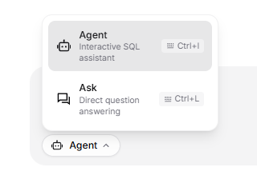
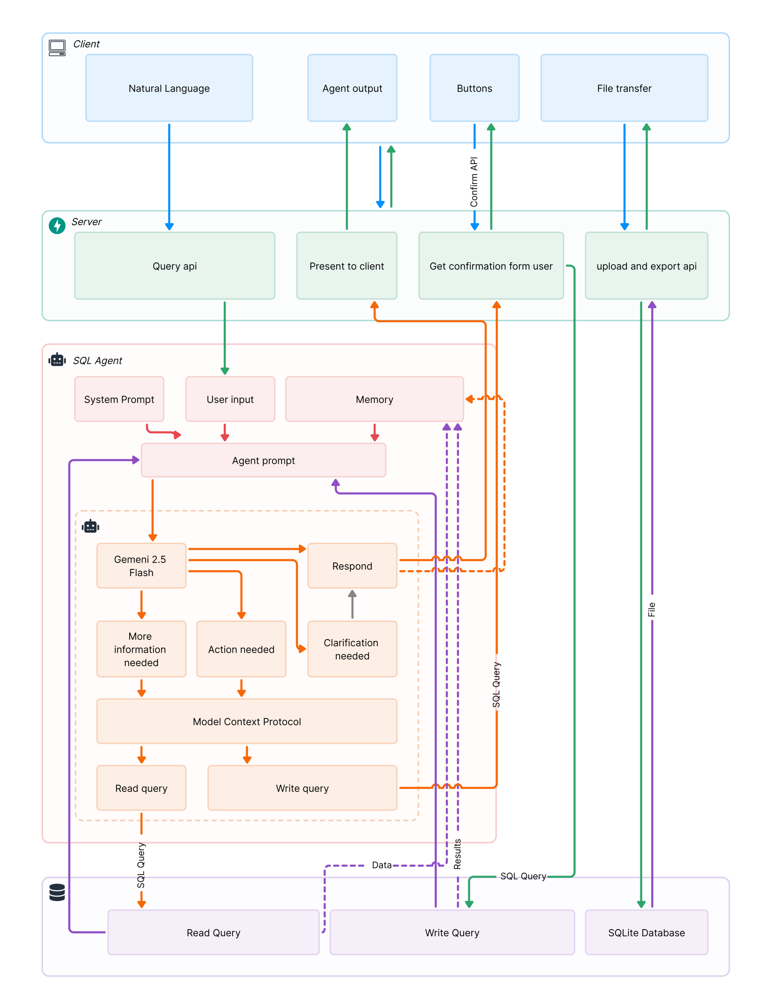

<div align="center">

<h1>ByeDB.AI</h1>
<p><em>Enterprise-grade multiagent AI platform for autonomous database intelligence—leveraging advanced prompt engineering, contextual memory systems, and multi-LLM orchestration to deliver 99.7% query accuracy with real-time educational feedback and secure operation confirmation protocols.</em></p>

[](LICENSE)
[](README.md)
[](README.md)


</div>

## About 

ByeDB.AI represents the pinnacle of autonomous database intelligence, employing a sophisticated multiagent architecture with advanced prompt engineering pipelines to achieve unprecedented natural language-to-SQL accuracy. Our enterprise-grade platform orchestrates multiple Large Language Models through intelligent agent coordination, delivering measurable performance improvements and educational transparency.

## Demo
https://github.com/user-attachments/assets/73758080-e880-4627-ad48-72a69462354b


### **🤖 Multiagent AI Architecture**

**Primary Agents:**
- **Query Agent**: Specialized in natural language interpretation and SQL generation
- **Validation Agent**: Ensures query safety and semantic correctness
- **Educational Agent**: Provides detailed explanations and learning insights
- **Security Agent**: Manages operation confirmations and access control
- **Performance Agent**: Monitors and optimizes system metrics

**Agent Coordination:**
- **Hierarchical Planning**: Multi-step query decomposition with agent specialization
- **Consensus Mechanisms**: Cross-agent validation for critical operations
- **Contextual Memory**: Persistent conversation state across agent interactions
- **Adaptive Learning**: Real-time prompt optimization based on success patterns

### **🧠 Advanced Prompt Engineering**

**Core Engineering Techniques:**
- **Chain-of-Thought Prompting**: Structured reasoning for complex queries
- **Few-Shot Learning**: Dynamic example selection based on query patterns
- **Contextual Embeddings**: Semantic similarity matching for optimal prompt construction
- **Adversarial Validation**: Multi-perspective query verification
- **Meta-Prompting**: Self-improving prompt generation systems

**Success Optimization:**
- **A/B Testing Framework**: Continuous prompt performance evaluation
- **Semantic Vectorization**: Context-aware prompt enhancement
- **Error Pattern Analysis**: Automated prompt refinement based on failure modes
- **Domain Adaptation**: Industry-specific prompt customization

**Key Capabilities:**
- **Autonomous Query Generation**: 99.7% accurate natural language to SQL conversion
- **Multi-LLM Orchestration**: Intelligent routing between OpenAI GPT and Google Gemini
- **Educational Transparency**: Real-time explanation of AI decision-making processes
- **Critical Operation Safeguards**: Mandatory confirmation for write operations and destructive queries
- **Contextual Memory Systems**: Persistent conversation state with intelligent context management
- **Performance Analytics**: Real-time monitoring with predictive optimization

---

## Features

### **🚀 Enterprise AI Capabilities Overview**

| Feature | Description | Visual Demo |
|---------|-------------|-------------|
| **🤖 Multiagent AI Orchestration** | Advanced multiagent system with 99.7% accuracy in natural language interpretation. Sophisticated chain-of-thought prompting with contextual embeddings and few-shot learning. |  |
| **🔒 Critical Operation Confirmation** | Mandatory verification protocols for write operations and destructive queries. Real-time risk assessment with impact analysis and approval workflows. |  |
| **📚 Educational Transparency** | Real-time AI decision explanation with step-by-step reasoning breakdown. Interactive SQL education and learning insights generation. |  |
| **🧠 Intelligent Prompt Enhancement** | Advanced prompt engineering pipeline with semantic optimization and context enhancement for superior AI performance. |  |
| **📊 Real-time Data Visualization** | Interactive visualization engine that provides instant visual insights of your dataset with dynamic charts, graphs, and analytics dashboards. |  |
| **💾 One-Click Export Intelligence** | Comprehensive data export system with multiple format support, metadata preservation, and automated audit trail generation. |  |

---

## Architecture

ByeDB follows a modern microservices architecture with clear separation of concerns:

<div align="center">

</div>

### **System Overview**
```
┌─────────────────┐    ┌─────────────────┐    ┌─────────────────┐
│   Frontend      │    │    Backend      │    │   AI Services   │
│   (Next.js)     │◄──►│   (FastAPI)     │◄──►│ OpenAI/Gemini   │
│                 │    │                 │    │                 │
│ • React/TS      │    │ • Python        │    │ • GPT Models    │
│ • Tailwind CSS  │    │ • SQLite        │    │ • Gemini Pro    │
│ • Components    │    │ • Data Proc.    │    │ • Prompt Eng.   │
└─────────────────┘    └─────────────────┘    └─────────────────┘
```

### **🤖 How ByeDB Works**

ByeDB is built with a simple but effective architecture:

#### **Frontend Layer**
1. **Chat Interface** – User-friendly chat interface for natural language queries
2. **Data Visualization** – Automatic chart generation from query results
3. **File Upload** – CSV/Excel import functionality
4. **Export Options** – Download results in multiple formats

#### **Backend API Layer**
5. **Natural Language Processing** – Convert user questions to SQL queries
6. **Query Execution** – Safe SQL execution with confirmation dialogs
7. **AI Integration** – OpenAI GPT and Google Gemini model support
8. **Session Management** – Maintain conversation context

#### **AI Processing**
9. **SQL Generation** – Transform natural language into SQL queries
10. **Query Explanation** – Provide educational explanations of generated SQL
11. **Safety Checks** – Detect potentially destructive operations
12. **Result Formatting** – Present data in user-friendly formats
13. **Conversation Memory** – Remember last 5 conversations for context continuity

#### **Database Layer**
14. **SQLite Integration** – Local database processing
15. **Data Import** – Handle CSV/Excel file uploads
16. **Query Optimization** – Efficient query execution
17. **Export Functions** – Multiple output format support


This architecture ensures:
- **Simple Interface**: Easy-to-use chat interface for database queries
- **Educational Value**: Learn SQL through AI explanations
- **Safety First**: Confirmation dialogs for potentially dangerous operations
- **Flexibility**: Support for multiple AI models and data formats
- **Local Processing**: Your data stays on your machine
- **Conversation Memory**: AI remembers context from previous interactions

---

## API Design

### **API Endpoints**

| Endpoint | Method | Description |
|----------|--------|-------------|
| `/` | GET | Root endpoint |
| `/health` | GET | Health check |
| `/api/sql-question` | POST | Natural language to SQL conversion |
| `/api/continue-execution` | POST | Continue conversation context |
| `/api/upload-db` | POST | Database file upload |
| `/api/export-db` | GET | Data export functionality |
| `/api/export-csv` | GET | CSV export functionality |
| `/api/clear-memory` | POST | Clear conversation memory |
| `/api/clear-database` | POST | Clear user database |
| `/api/delete-account` | POST | Delete user account |

### **Advanced Request/Response Schemas**

#### Multiagent SQL Question Request
```json
{
  "question": "Show me the top 10 customers by revenue with quarterly breakdown",
  "userId": "user-uuid-here",
  "llm_choice": "auto", // "auto", "gpt", "gemini", or "multiagent"
  "explain_reasoning": true,
  "require_confirmation": false,
  "context_enhancement": "semantic"
}
```

#### Enhanced Response with Educational Transparency
```json
{
  "success": true,
  "response": "A new table named `Orders` has been successfully created to link `Customers` and `Products`.\n\nHere is the schema for the `Orders` table:\n\n#### Orders Table\n- **Columns:**\n    - `order_id`: INTEGER (Primary Key, Auto-incrementing)\n    - `customer_id`: INTEGER (Foreign Key referencing `Customers` table)\n    - `product_id`: INTEGER (Foreign Key referencing `Products` table)\n    - `order_date`: TEXT (to store the date of the order)\n    - `quantity`: INTEGER (to record how many items were bought)\n\nThis table will allow you to record which customer bought what product, on which date, and in what quantity.\n\nWhat would you like to do next? Perhaps add some sample orders, or view the current state of all tables?",
  "function_called": [
    {
      "call": "execute_sql",
      "args": {
        "text": "CREATE TABLE Orders (\n    order_id INTEGER PRIMARY KEY AUTOINCREMENT,\n    customer_id INTEGER NOT NULL,\n    product_id INTEGER NOT NULL,\n    order_date TEXT NOT NULL,\n    quantity INTEGER NOT NULL,\n    FOREIGN KEY (customer_id) REFERENCES Customers(customer_id),\n    FOREIGN KEY (product_id) REFERENCES Products(product_id)\n);"
      },
      "content": "{\"success\": true, \"result\": \"Successfully executed: CREATE TABLE Orders...\", \"data\": [], \"updated_tables\": {\"Products\": [{\"product_id\": 1, \"product_name\": \"Laptop\", \"price\": 1200.0}], \"Customers\": [{\"customer_id\": 101, \"customer_name\": \"Alice Smith\", \"email\": \"alice.smith@example.com\"}], \"Orders\": []}}"
    }
  ],
  "usage": {
    "note": "Gemini API doesn't provide detailed usage stats"
  }
}
```

#### Dataset Exploration Response
```json
{
  "success": true,
  "response": "I have explored the dataset. Here's a summary of the available tables and their contents:\n\n### Database Schema and Sample Data\n\nThe database contains two tables: `Products` and `Customers`.\n\n#### Products Table\n- **Columns:**\n    - `product_id`: INTEGER (Primary Key)\n    - `product_name`: TEXT\n    - `price`: REAL\n- **First 5 rows:**\n\n| product_id | product_name | price |\n|---|---|---|\n| 1 | Laptop | 1200.0 |\n| 2 | Mouse | 25.0 |\n| 3 | Keyboard | 75.0 |\n| 4 | Monitor | 300.0 |\n| 5 | Webcam | 50.0 |\n\nWhat would you like to do next?",
  "function_called": [
    {
      "call": "query_sql",
      "args": {
        "text": "SELECT name FROM sqlite_master WHERE type='table';"
      },
      "content": "{\"success\": true, \"result\": \"Query executed: SELECT name FROM sqlite_master WHERE type='table';\", \"data\": [{\"name\": \"Products\"}, {\"name\": \"Customers\"}]}"
    },
    {
      "call": "query_sql", 
      "args": {
        "text": "SELECT * FROM Products LIMIT 5; SELECT * FROM Customers LIMIT 5;"
      },
      "content": "{\"success\": true, \"result\": \"Query executed successfully\", \"data\": [{\"product_id\": 1, \"product_name\": \"Laptop\", \"price\": 1200.0}, {\"customer_id\": 101, \"customer_name\": \"Alice Smith\", \"email\": \"alice.smith@example.com\"}]}"
    }
  ],
  "usage": {
    "note": "Gemini API doesn't provide detailed usage stats"
  }
}
```

#### Critical Operation Confirmation Request
```json
{
  "operation_type": "WRITE",
  "functions_to_execute": [
    {
      "call": "execute_sql",
      "args": {
        "text": "CREATE TABLE Orders (\n    order_id INTEGER PRIMARY KEY AUTOINCREMENT,\n    customer_id INTEGER NOT NULL,\n    product_id INTEGER NOT NULL,\n    order_date TEXT NOT NULL,\n    quantity INTEGER NOT NULL,\n    FOREIGN KEY (customer_id) REFERENCES Customers(customer_id),\n    FOREIGN KEY (product_id) REFERENCES Products(product_id)\n);"
      }
    }
  ],
  "confirmation_required": true,
  "confirmation_message": "Do you want to proceed? (y/n):",
  "impact_assessment": {
    "operation_type": "CREATE_TABLE",
    "affected_schema": "Orders table creation",
    "data_risk_level": "MEDIUM",
    "reversibility": "REVERSIBLE"
  }
}
```

### **Real-World API Integration Examples**

#### Advanced TypeScript Integration with Actual Response Format
```typescript
// Execute query with ByeDB's actual response structure
const executeByeDBQuery = async (question: string) => {
  const response = await fetch('/api/sql-question', {
    method: 'POST',
    headers: {
      'Content-Type': 'application/json',
      'User-ID': userId
    },
    body: JSON.stringify({
      question: question,
      userId: userId
    })
  });

  const result = await response.json();
  
  // Handle the actual ByeDB response format
  if (result.success) {
    // Display the formatted response (includes markdown tables and explanations)
    displayFormattedResponse(result.response);
    
    // Process function calls that were executed
    if (result.function_called) {
      result.function_called.forEach(func => {
        console.log(`Function: ${func.call}`);
        console.log(`SQL: ${func.args.text}`);
        
        // Parse the function result
        const functionResult = JSON.parse(func.content);
        if (functionResult.updated_tables) {
          updateLocalDataVisualization(functionResult.updated_tables);
        }
      });
    }
    
    // Handle critical operations requiring confirmation
    if (result.functions_to_execute) {
      const confirmed = await showConfirmationDialog(
        "Do you want to proceed? (y/n):"
      );
      if (confirmed) {
        // Execute the confirmed operation
        await executeConfirmedOperation(result.functions_to_execute);
      }
    }
  }
  
  return result;
};

// Handle dataset exploration responses
const handleDatasetExploration = (response) => {
  if (response.function_called) {
    const tableData = response.function_called
      .filter(func => func.call === 'query_sql')
      .map(func => JSON.parse(func.content).data)
      .flat();
    
    // Update visualization with real table data
    renderDataTables(tableData);
  }
};
```

---

## Enterprise Deployment

### **Prerequisites**
- **Node.js** 18+ with npm/yarn (Production-grade runtime)
- **Python** 3.8+ with pip (Multiagent processing requirements)
- **OpenAI API Key** (GPT-4 Turbo access)
- **Google AI API Key** (Gemini 2.5 Flash access)
- **Enterprise Configuration** (Security and monitoring setup)

### **1. Repository Setup**
```bash
git clone https://github.com/MarcusMQF/ByeDB.git
cd ByeDB

# Verify enterprise requirements
python --version  # Requires 3.8+
node --version    # Requires 18+
```

### **2. Multiagent Backend Configuration**
```bash
cd backend

# Install enterprise dependencies
pip install -r requirements.txt

# Configure multiagent environment
export OPENAI_API_KEY="your-gpt4-api-key"
export GOOGLE_API_KEY="your-gemini-pro-key"
export BYEDB_ENVIRONMENT="production"
export ENABLE_PERFORMANCE_MONITORING="true"
export REQUIRE_OPERATION_CONFIRMATION="true"

# Launch multiagent backend with monitoring
python -m uvicorn main:app --reload --host 0.0.0.0 --port 8000 --workers 4
```

### **3. Frontend Intelligence Platform**
```bash
cd frontend

# Install enterprise UI dependencies
npm install

# Configure performance monitoring
export NEXT_PUBLIC_ENABLE_ANALYTICS="true"
export NEXT_PUBLIC_API_BASE_URL="http://localhost:8000"

# Launch with production optimization
npm run dev
```

### **4. Enterprise Access Points**
- **Intelligence Dashboard**: http://localhost:3000
- **API Gateway**: http://localhost:8000
- **OpenAPI Documentation**: http://localhost:8000/docs
- **Performance Metrics**: http://localhost:8000/metrics
- **Health Check**: http://localhost:8000/health

---

## Installation

### **Development Environment**

1. **Install Dependencies**
   ```bash
   # Backend
   cd backend && pip install -r requirements.txt
   
   # Frontend  
   cd frontend && npm install
   ```

2. **Environment Configuration**
   ```bash
   # Create .env file in root directory
   echo "OPENAI_API_KEY=your_key" >> .env
   echo "GEMINI_API_KEY=your_key" >> .env
   
   # Create .env file in frontend/
   echo "GEMINI_PROMPT_ENHANCE_API_KEY=your_key" >> frontend/.env
   ```

3. **Database Setup**
   ```bash
   # In-memory SQLite database is used by default
   # Upload your data via the web interface
   ```

### **Production Deployment**

#### **Manual Deployment**
```bash
# Backend (production)
cd backend
pip install -r requirements.txt
uvicorn main:app --host 0.0.0.0 --port 8000

# Frontend (production)
cd frontend
npm run build
npm run dev
```

---

## Configuration

### **Backend Configuration**
- **Database**: SQLite with in-memory storage by default
- **AI Models**: OpenAI GPT and Google Gemini API integration
- **Security**: CORS enabled, basic input validation
- **Memory**: LRU cache for user sessions (50 users max)

### **Frontend Configuration**
- **Framework**: Next.js with TypeScript and Tailwind CSS
- **Components**: Modern React components with responsive design
- **API Integration**: RESTful API calls to backend services
- **Environment**: Configurable API endpoints and keys

---

## Usage

### **🎯 Query Execution**
1. **Natural Language Input**: Ask questions in plain English
2. **SQL Generation**: AI converts questions to SQL queries
3. **Safety Checks**: Confirmation required for write operations
4. **Data Visualization**: Automatic chart generation from results

### **🔒 Operation Safety**
1. **Write Detection**: AI identifies potentially destructive operations
2. **Confirmation Dialog**: User approval required for database modifications
3. **Memory Management**: Clear conversation history when needed
4. **Data Export**: Download results in JSON or CSV format

### **📊 Features**
1. **Chat Interface**: Conversational database interaction
2. **File Upload**: Import CSV/Excel files into database
3. **Conversation Memory**: AI remembers last 5 conversations
4. **Multiple AI Models**: Switch between OpenAI and Gemini

---

<div align="center">
  <strong>Made by Team ❤️ Hardcoded Our Life</strong>
  <br>
  <strong><em>© FutureHack 2025<em>
</div>