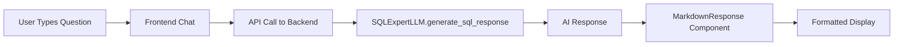

# Frontend Integration Guide

This guide shows you how to integrate your `llm.py` with the frontend to replace the hardcoded "How can I help you?" response with real AI responses.

## 🎯 What We've Built

- **Backend API**: Your `llm.py` is now integrated with FastAPI
- **Frontend Integration**: Chat component calls the backend API
- **Markdown Support**: AI responses are formatted with bold text and code blocks
- **Copy Functionality**: Users can copy SQL code blocks easily

## 🚀 Setup Instructions

### 1. Backend Setup

1. **Navigate to backend directory**:
   ```bash
   cd backend
   ```

2. **Install dependencies** (if not already done):
   ```bash
   pip install -r requirements.txt
   ```

3. **Set up environment variables**:
   Create a `.env` file in the `backend` directory:
   ```env
   GITHUB_TOKEN=your_github_token_here
   ```

4. **Test your LLM directly** (optional):
   ```bash
   python llm.py quick
   ```

5. **Start the backend server**:
   ```bash
   uvicorn main:app --reload --host 0.0.0.0 --port 8000
   ```

### 2. Frontend Setup

1. **Navigate to frontend directory**:
   ```bash
   cd frontend
   ```

2. **Install dependencies** (if not already done):
   ```bash
   npm install
   ```

3. **Start the development server**:
   ```bash
   npm run dev
   ```

### 3. Test the Integration

1. **Run the integration test**:
   ```bash
   cd backend
   python test_integration.py
   ```

2. **Open your browser**:
   - Go to `http://localhost:3000`
   - Try asking SQL questions like:
     - "How do I create a users table?"
     - "Show me a SELECT query example"
     - "How to optimize database performance?"

## ✨ Features

### 1. Real AI Responses
- No more hardcoded "How can I help you?"
- Powered by your `SQLExpertLLM` class
- Context-aware responses based on user intent

### 2. Markdown Formatting
- **Bold text** using `**text**`
- Code blocks with syntax highlighting
- Inline code with `backticks`

### 3. Copy Functionality
- Click the copy button on any code block
- Visual feedback when copied
- Perfect for SQL queries

### 4. Error Handling
- Connection errors are handled gracefully
- Clear error messages for users
- Fallback responses when API is unavailable

## 🔧 How It Works



### Backend Flow:
1. `chat.tsx` sends POST request to `/api/sql-question`
2. `main.py` receives request and calls `SQLExpertLLM`
3. `llm.py` generates AI response using GitHub Models API
4. Response is sent back to frontend

### Frontend Flow:
1. User types question and hits "Ask ByeDB"
2. `handleSendMessage` calls backend API
3. Response is processed by `MarkdownResponse` component
4. Formatted response is displayed with copy functionality

## 🛠️ Troubleshooting

### Common Issues:

1. **"Connection error" in browser**:
   - Make sure backend is running on `https://byedb-ai-cml2.onrender.com`
   - Check that CORS is configured (should be automatic)

2. **"GITHUB_TOKEN not set" error**:
   - Create `.env` file in backend directory
   - Add your GitHub token from GitHub Settings > Developer settings

3. **"Failed to copy text" error**:
   - This is usually browser security - works on `localhost`
   - Make sure you're using HTTPS in production

4. **Backend not responding**:
   - Check if port 8000 is available
   - Verify all dependencies are installed
   - Check the terminal for error messages

### Testing Individual Components:

1. **Test LLM directly**:
   ```bash
   cd backend
   python llm.py interactive
   ```

2. **Test API endpoint**:
   ```bash
   curl -X POST https://byedb-ai-cml2.onrender.com/api/sql-question \
     -H "Content-Type: application/json" \
     -d '{"question": "How do I create a users table?"}'
   ```

3. **Test frontend formatting**:
   - Open browser dev tools
   - Check network tab for API calls
   - Verify responses are being formatted

## 📁 File Structure

```
backend/
├── main.py              # FastAPI app with /api/sql-question endpoint
├── llm.py               # Your SQLExpertLLM class
├── test_integration.py  # Integration tests
├── requirements.txt     # Python dependencies
└── .env                 # Environment variables (create this)

frontend/
├── components/
│   ├── chat.tsx              # Updated with API integration
│   └── markdown-response.tsx # Formats AI responses
└── ...
```

## 🎉 Success!

If everything is working correctly, you should see:
- ✅ Real AI responses instead of "How can I help you?"
- ✅ Properly formatted code blocks with copy buttons
- ✅ Bold text and inline code formatting
- ✅ Error handling for connection issues

## 🔄 Next Steps

You can now:
1. Customize the AI prompts in `llm.py`
2. Add more response formatting in `markdown-response.tsx`
3. Extend the API with additional endpoints
4. Add authentication and rate limiting
5. Deploy to production

## 💡 Tips

- The AI responses are cached for better performance
- You can modify the system prompts in `llm.py` for different behavior
- The markdown formatter supports most common formatting
- File upload context is automatically included in API calls

Enjoy your new AI-powered SQL assistant! 🚀 