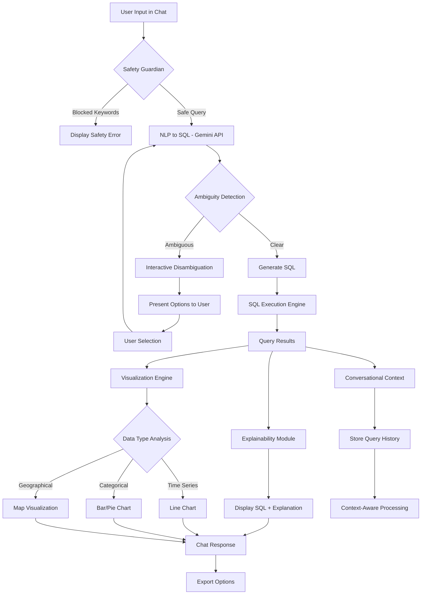

# mplementation Plan

## Multi-Agent Architecture

### Agent 1: Safety Guardian
- **Purpose**: Block destructive queries before processing
- **Input**: Raw user query
- **Output**: Safe/Blocked status + error message if blocked

### Agent 2: NLP-to-SQL Translator
- **Purpose**: Convert natural language to SQL
- **Input**: Safe user query + context
- **Output**: SQL query + confidence score + ambiguity flags

### Agent 3: Disambiguation Handler
- **Purpose**: Handle ambiguous queries
- **Input**: Ambiguous query + possible interpretations
- **Output**: Clarification options for user

### Agent 4: SQL Executor
- **Purpose**: Execute SQL safely against data
- **Input**: Validated SQL query
- **Output**: Query results + metadata

### Agent 5: Explainer
- **Purpose**: Explain SQL in plain English
- **Input**: SQL query + results
- **Output**: Human-readable explanation

### Agent 6: Visualizer
- **Purpose**: Auto-generate charts from data
- **Input**: Query results + column metadata
- **Output**: Chart type + chart config

### Agent 7: Context Manager
- **Purpose**: Maintain conversation context
- **Input**: Current query + previous queries
- **Output**: Enhanced query with context

## Critical APIs to Implement

### 1. `/api/chat` - Main Chat Endpoint
```typescript
POST /api/chat
{
  message: string,
  conversationId?: string,
  previousContext?: QueryContext
}

Response:
{
  response: ChatResponse,
  sql?: string,
  explanation?: string,
  visualization?: ChartConfig,
  disambiguation?: DisambiguationOptions,
  error?: string
}
```

### 2. `/api/upload` - File Upload Handler
```typescript
POST /api/upload
FormData: { file: File }

Response:
{
  success: boolean,
  tableId: string,
  columns: ColumnInfo[],
  rowCount: number,
  preview: any[]
}
```

### 3. `/api/execute-sql` - SQL Execution
```typescript
POST /api/execute-sql
{
  sql: string,
  tableId?: string,
  limit?: number
}

Response:
{
  results: any[],
  columns: ColumnInfo[],
  executionTime: number,
  rowCount: number
}
```

### 4. `/api/disambiguate` - Handle Disambiguation
```typescript
POST /api/disambiguate
{
  originalQuery: string,
  selectedOption: string,
  context: QueryContext
}

Response: ChatResponse
```

## Data Models

### QueryContext
```typescript
interface QueryContext {
  previousQueries: string[];
  previousSQL: string[];
  currentTable?: string;
  availableColumns: ColumnInfo[];
}
```

### ColumnInfo
```typescript
interface ColumnInfo {
  name: string;
  type: 'string' | 'number' | 'date' | 'boolean';
  unique_values?: string[];
  sample_values: any[];
}
```

### ChartConfig
```typescript
interface ChartConfig {
  type: 'line' | 'bar' | 'pie' | 'scatter';
  data: any[];
  xAxis?: string;
  yAxis?: string;
  config: any;
}
```

## System Design Flow



## Core Implementation

### Required Packages
```bash
npm install @google/generative-ai papaparse xlsx recharts sql.js
```

### Safety Guardian + Basic NLP-to-SQL
```typescript
// lib/agents/safety-guardian.ts
export class SafetyGuardian {
  private blockedKeywords = ['DELETE', 'DROP', 'UPDATE', 'TRUNCATE', 'INSERT', 'ALTER', 'CREATE'];
  
  check(query: string): { safe: boolean; message?: string } {
    const upperQuery = query.toUpperCase();
    const blocked = this.blockedKeywords.find(keyword => upperQuery.includes(keyword));
    
    if (blocked) {
      return {
        safe: false,
        message: "Sorry, I am a read-only assistant and cannot make changes to the database. I can only retrieve information."
      };
    }
    return { safe: true };
  }
}
```

### Gemini Integration
```typescript
// lib/agents/nlp-to-sql.ts
import { GoogleGenerativeAI } from '@google/generative-ai';

export class NLPToSQL {
  private genAI = new GoogleGenerativeAI(process.env.GEMINI_API_KEY!);
  
  async generateSQL(query: string, context: QueryContext): Promise<SQLResult> {
    const model = this.genAI.getGenerativeModel({ model: "gemini-2.0-flash" });
    
    const prompt = `
    Convert this natural language query to SQL:
    Query: "${query}"
    
    Available tables and columns:
    ${context.availableColumns.map(col => `${col.name} (${col.type})`).join(', ')}
    
    Previous context:
    ${context.previousSQL.slice(-2).join('\n')}
    
    Rules:
    - Only generate SELECT statements
    - Use proper SQL syntax
    - If ambiguous, flag as needs_disambiguation
    
    Respond in JSON format:
    {
      "sql": "SELECT ...",
      "confidence": 0.95,
      "needs_disambiguation": false,
      "ambiguous_terms": []
    }
    `;
    
    const result = await model.generateContent(prompt);
    return JSON.parse(result.response.text());
  }
}
```

### SQL Execution Engine
```typescript
// lib/agents/sql-executor.ts
import Database from 'sql.js';

export class SQLExecutor {
  private db: Database.Database;
  
  constructor() {
    this.db = new Database.Database();
  }
  
  loadCSVData(data: any[], tableName: string = 'user_data') {
    // Create table dynamically based on data structure
    const columns = Object.keys(data[0]);
    const createTable = `CREATE TABLE ${tableName} (${columns.map(col => `${col} TEXT`).join(', ')})`;
    
    this.db.run(createTable);
    
    // Insert data
    const insertStmt = this.db.prepare(`INSERT INTO ${tableName} VALUES (${columns.map(() => '?').join(', ')})`);
    data.forEach(row => {
      insertStmt.run(columns.map(col => row[col]));
    });
    insertStmt.free();
  }
  
  execute(sql: string): QueryResult {
    try {
      const stmt = this.db.prepare(sql);
      const results = [];
      
      while (stmt.step()) {
        results.push(stmt.getAsObject());
      }
      
      stmt.free();
      return { success: true, data: results, columns: stmt.getColumnNames() };
    } catch (error) {
      return { success: false, error: error.message };
    }
  }
}
```

## Advanced Features

### Explainability Agent
```typescript
// lib/agents/explainer.ts
export class SQLExplainer {
  async explainSQL(sql: string, results: any[]): Promise<string> {
    const model = this.genAI.getGenerativeModel({ model: "gemini-2.0-flash" });
    
    const prompt = `
    Explain this SQL query in simple English:
    SQL: ${sql}
    
    Results returned: ${results.length} rows
    
    Explain what this query does in one clear sentence.
    `;
    
    const result = await model.generateContent(prompt);
    return result.response.text();
  }
}
```

### Auto-Visualization
```typescript
// lib/agents/visualizer.ts
export class DataVisualizer {
  analyzeData(data: any[], columns: ColumnInfo[]): ChartConfig | null {
    if (data.length === 0) return null;
    
    const numericColumns = columns.filter(col => col.type === 'number');
    const dateColumns = columns.filter(col => col.type === 'date');
    const categoricalColumns = columns.filter(col => col.type === 'string');
    
    // Time series: date + numeric
    if (dateColumns.length > 0 && numericColumns.length > 0) {
      return {
        type: 'line',
        data,
        xAxis: dateColumns[0].name,
        yAxis: numericColumns[0].name,
        config: { responsive: true }
      };
    }
    
    // Categorical: string + numeric
    if (categoricalColumns.length > 0 && numericColumns.length > 0) {
      const uniqueValues = [...new Set(data.map(row => row[categoricalColumns[0].name]))];
      
      return {
        type: uniqueValues.length > 10 ? 'bar' : 'pie',
        data,
        xAxis: categoricalColumns[0].name,
        yAxis: numericColumns[0].name,
        config: { responsive: true }
      };
    }
    
    return null;
  }
}
```

### Interactive Disambiguation
```typescript
// lib/agents/disambiguation.ts
export class DisambiguationHandler {
  async detectAmbiguity(query: string, context: QueryContext): Promise<DisambiguationOptions | null> {
    const ambiguousTerms = this.findAmbiguousTerms(query, context);
    
    if (ambiguousTerms.length === 0) return null;
    
    return {
      message: `I found multiple interpretations for "${ambiguousTerms[0].term}". Which one did you mean?`,
      options: ambiguousTerms[0].options,
      originalQuery: query
    };
  }
  
  private findAmbiguousTerms(query: string, context: QueryContext): AmbiguousTerm[] {
    const terms = [];
    
    // Check for location ambiguity
    if (query.toLowerCase().includes('new york')) {
      terms.push({
        term: 'New York',
        options: ['New York City', 'New York State']
      });
    }
    
    // Check for time ambiguity
    if (query.toLowerCase().includes('last month')) {
      terms.push({
        term: 'last month',
        options: ['Previous 30 days', 'Previous calendar month']
      });
    }
    
    return terms;
  }
}
```

### Conversational Context
```typescript
// lib/agents/context-manager.ts
export class ContextManager {
  private contexts = new Map<string, QueryContext>();
  
  updateContext(conversationId: string, query: string, sql: string, results: any[]) {
    const context = this.contexts.get(conversationId) || {
      previousQueries: [],
      previousSQL: [],
      availableColumns: []
    };
    
    context.previousQueries.push(query);
    context.previousSQL.push(sql);
    
    // Keep only last 5 queries for context
    if (context.previousQueries.length > 5) {
      context.previousQueries.shift();
      context.previousSQL.shift();
    }
    
    this.contexts.set(conversationId, context);
  }
  
  getContext(conversationId: string): QueryContext {
    return this.contexts.get(conversationId) || {
      previousQueries: [],
      previousSQL: [],
      availableColumns: []
    };
  }
}
```

## UI Components to Create

### 1. SQL Display Component
```typescript
// components/sql-display.tsx
export function SQLDisplay({ sql, explanation }: { sql: string; explanation: string }) {
  return (
    <div className="bg-gray-50 p-4 rounded-lg">
      <h4 className="font-semibold mb-2">Generated SQL:</h4>
      <pre className="bg-gray-800 text-green-400 p-3 rounded text-sm overflow-x-auto">
        {sql}
      </pre>
      <p className="mt-2 text-sm text-gray-600">{explanation}</p>
    </div>
  );
}
```

### 2. Chart Component
```typescript
// components/data-chart.tsx
import { LineChart, BarChart, PieChart } from 'recharts';

export function DataChart({ config }: { config: ChartConfig }) {
  switch (config.type) {
    case 'line':
      return <LineChart data={config.data} {...config.config} />;
    case 'bar':
      return <BarChart data={config.data} {...config.config} />;
    case 'pie':
      return <PieChart data={config.data} {...config.config} />;
    default:
      return null;
  }
}
```

### 3. Disambiguation Component
```typescript
// components/disambiguation.tsx
export function DisambiguationOptions({ options, onSelect }: DisambiguationProps) {
  return (
    <div className="bg-blue-50 p-4 rounded-lg">
      <p className="mb-3">{options.message}</p>
      <div className="flex gap-2">
        {options.options.map((option, index) => (
          <button
            key={index}
            onClick={() => onSelect(option)}
            className="px-3 py-1 bg-blue-500 text-white rounded hover:bg-blue-600"
          >
            {option}
          </button>
        ))}
      </div>
    </div>
  );
}
```

## Environment Variables Needed
```env
GEMINI_API_KEY=your_gemini_api_key_here
```

## File Upload Integration
```typescript
// lib/file-processor.ts
import Papa from 'papaparse';
import * as XLSX from 'xlsx';

export class FileProcessor {
  async processCSV(file: File): Promise<{ data: any[]; columns: ColumnInfo[] }> {
    return new Promise((resolve, reject) => {
      Papa.parse(file, {
        header: true,
        complete: (results) => {
          const data = results.data;
          const columns = this.inferColumnTypes(data);
          resolve({ data, columns });
        },
        error: reject
      });
    });
  }
  
  private inferColumnTypes(data: any[]): ColumnInfo[] {
    const sample = data[0];
    return Object.keys(sample).map(key => ({
      name: key,
      type: this.inferType(data.map(row => row[key])),
      sample_values: data.slice(0, 5).map(row => row[key])
    }));
  }
  
  private inferType(values: any[]): 'string' | 'number' | 'date' | 'boolean' {
    const nonNullValues = values.filter(v => v != null && v !== '');
    
    if (nonNullValues.every(v => !isNaN(Number(v)))) return 'number';
    if (nonNullValues.every(v => !isNaN(Date.parse(v)))) return 'date';
    if (nonNullValues.every(v => v === 'true' || v === 'false')) return 'boolean';
    
    return 'string';
  }
}
```

## Testing Strategy

### Sample Data for Demo
```typescript
// lib/sample-data.ts
export const sampleData = [
  { id: 1, name: 'John Doe', city: 'New York City', state: 'NY', sales: 1000, date: '2024-01-15' },
  { id: 2, name: 'Jane Smith', city: 'Los Angeles', state: 'CA', sales: 1500, date: '2024-01-16' },
  { id: 3, name: 'Bob Johnson', city: 'Albany', state: 'NY', sales: 800, date: '2024-01-17' },
  // ... more sample data
];
```

### Demo Queries to Test
1. "Show me total sales by state"
2. "Who are the top 5 customers by sales?"
3. "Show me sales for New York" (should trigger disambiguation)
4. "Now just show me the data for last month" (context test)
5. "Delete all records" (safety test)

## Priority Order (If Time Runs Out)
1. ✅ Safety Guardian (must have)
2. ✅ Basic NLP-to-SQL (core functionality)
3. ✅ SQL Execution (must have)
4. ✅ Explainability (builds trust)
5. ✅ Auto-Visualization (visually impressive)
6. ⚠️ File Upload (nice to have)
7. ⚠️ Disambiguation (complex but impressive)
8. ⚠️ Conversational Context (advanced feature)

## Final Integration
Update your existing `components/chat.tsx` to orchestrate all agents and display results in the chat interface. The chat should show:
- User query
- Safety warnings (if any)
- Disambiguation options (if needed)
- Generated SQL + explanation
- Data visualization
- Raw data table
- Export options

This is your complete roadmap. Focus on getting the core features working first, then add the advanced features if time permits.
