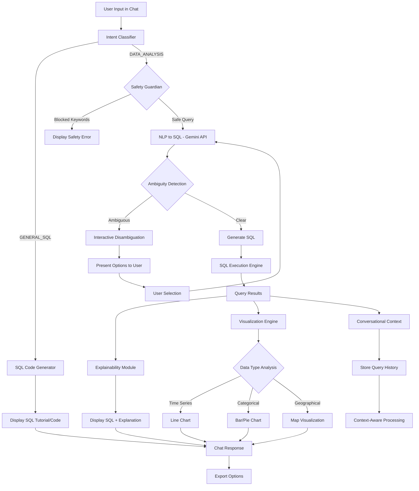

# Implementation Plan

## Multi-Agent Architecture

### Agent 0: Intent Classifier
- **Purpose**: Determine if user wants general SQL help OR data analysis
- **Input**: Raw user query
- **Output**: Intent type (GENERAL_SQL | DATA_ANALYSIS) + confidence

### Agent 1: Safety Guardian
- **Purpose**: Block destructive queries before processing
- **Input**: Raw user query
- **Output**: Safe/Blocked status + error message if blocked

### Agent 2: NLP-to-SQL Translator
- **Purpose**: Convert natural language to SQL
- **Input**: Safe user query + context
- **Output**: SQL query + confidence score + ambiguity flags

### Agent 3: Disambiguation Handler
- **Purpose**: Handle ambiguous queries
- **Input**: Ambiguous query + possible interpretations
- **Output**: Clarification options for user

### Agent 4: SQL Executor
- **Purpose**: Execute SQL safely against data
- **Input**: Validated SQL query
- **Output**: Query results + metadata

### Agent 5: Explainer
- **Purpose**: Explain SQL in plain English
- **Input**: SQL query + results
- **Output**: Human-readable explanation

### Agent 6: Visualizer
- **Purpose**: Auto-generate charts from data
- **Input**: Query results + column metadata
- **Output**: Chart type + chart config

### Agent 7: Context Manager
- **Purpose**: Maintain conversation context
- **Input**: Current query + previous queries
- **Output**: Enhanced query with context

### Agent 8: SQL Code Generator
- **Purpose**: Generate SQL code examples and tutorials
- **Input**: General SQL question
- **Output**: SQL code + explanation + examples

## Critical APIs to Implement

### 1. `/api/chat` - Main Chat Endpoint
- **Input**: message, conversationId, previousContext
- **Output**: response, sql, explanation, visualization, disambiguation, error

### 2. `/api/upload` - File Upload Handler
- **Input**: FormData with file
- **Output**: success, tableId, columns, rowCount, preview

### 3. `/api/execute-sql` - SQL Execution
- **Input**: sql, tableId, limit
- **Output**: results, columns, executionTime, rowCount

### 4. `/api/disambiguate` - Handle Disambiguation
- **Input**: originalQuery, selectedOption, context
- **Output**: ChatResponse

## Data Models

### QueryContext
- previousQueries: string[]
- previousSQL: string[]
- currentTable?: string
- availableColumns: ColumnInfo[]

### ColumnInfo
- name: string
- type: 'string' | 'number' | 'date' | 'boolean'
- unique_values?: string[]
- sample_values: any[]

### ChartConfig
- type: 'line' | 'bar' | 'pie' | 'scatter'
- data: any[]
- xAxis?: string
- yAxis?: string
- config: any

## System Design Flow

## Core Implementation

### Required Packages
- @google/generative-ai
- papaparse
- xlsx
- recharts
- sql.js

### Safety Guardian + Basic NLP-to-SQL
- Block destructive keywords (DELETE, DROP, UPDATE, TRUNCATE, INSERT, ALTER, CREATE)
- Return safety status and error message if blocked

### Gemini Integration
- Use GoogleGenerativeAI with gemini-2.0-flash model
- Convert natural language to SQL with context awareness
- Return SQL with confidence score and ambiguity flags

### SQL Execution Engine
- Use sql.js for in-memory database
- Load CSV data dynamically into tables
- Execute SQL queries safely and return results

## Advanced Features

### Explainability Agent
- Use LLM to explain SQL queries in plain English
- Provide context about results and query logic
- Return simple, user-friendly explanations

### Auto-Visualization
- Analyze data types and structure to determine chart type
- Time series data → Line charts
- Categorical data → Bar/Pie charts
- Geographical data → Map visualizations

### Interactive Disambiguation
- Detect ambiguous terms in queries
- Present clarification options to users
- Handle common ambiguities (locations, time periods)

### Conversational Context
- Maintain conversation history and previous queries
- Enable iterative query refinement
- Store context for follow-up questions

### Intent Classification
- Determine if user wants SQL help or data analysis
- Route queries to appropriate agents
- Handle both tutorial and analysis modes

### SQL Code Generator
- Generate SQL code examples and tutorials
- Provide explanations and best practices
- Handle general SQL education queries

## UI Components to Create

### 1. SQL Display Component
- Display generated SQL with syntax highlighting
- Show explanation below the SQL code
- Format for readability

### 2. Chart Component
- Support multiple chart types (line, bar, pie)
- Use Recharts for visualization
- Responsive design

### 3. Disambiguation Component
- Display clarification message
- Show selectable options as buttons
- Handle user selection

## Environment Variables Needed
- GEMINI_API_KEY: Google Gemini API key

## File Upload Integration
- Support CSV and Excel files
- Use PapaParse for CSV parsing
- Use xlsx library for Excel files
- Infer column types automatically
- Return structured data with metadata

## Testing Strategy

### Sample Data for Demo
- Create sample sales/customer data
- Include various data types (string, number, date)
- Test with different geographical locations
- Include time-series data

### Demo Queries to Test
1. "Show me total sales by state"
2. "Who are the top 5 customers by sales?"
3. "Show me sales for New York" (should trigger disambiguation)
4. "Now just show me the data for last month" (context test)
5. "Delete all records" (safety test)
6. "How to write SQL for user authentication" (SQL help test)

## Priority Order (If Time Runs Out)
1. ✅ Safety Guardian (must have)
2. ✅ Basic NLP-to-SQL (core functionality)
3. ✅ SQL Execution (must have)
4. ✅ Explainability (builds trust)
5. ✅ Auto-Visualization (visually impressive)
6. ⚠️ File Upload (nice to have)
7. ⚠️ Disambiguation (complex but impressive)
8. ⚠️ Conversational Context (advanced feature)

## Final Integration
Update your existing `components/chat.tsx` to orchestrate all agents and display results in the chat interface. The chat should show:
- User query
- Safety warnings (if any)
- Disambiguation options (if needed)
- Generated SQL + explanation
- Data visualization
- Raw data table
- Export options

This is your complete roadmap. Focus on getting the core features working first, then add the advanced features if time permits.
