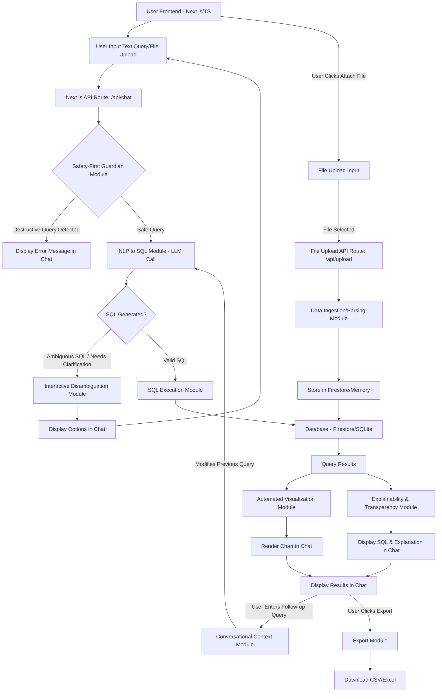

# Product Requirements Document

## 1. Introduction

ByeDB.ai is an innovative SaaS platform designed to empower non-technical users to interact with and analyze data using natural language. By transforming plain English queries into SQL, it provides instant access to insights, data visualizations, and export capabilities. 

For this hackathon, we will focus on delivering a compelling prototype that not only showcases core NLP-to-SQL functionality but also highlights five advanced, user-centric features:

- **Interactive Disambiguation**
- **Explainability & Transparency**
- **Automated Visualization**
- **Conversational Context**
- **Safety-First Guardian**

The user interface will adopt a familiar chat-like experience, similar to ChatGPT, integrating file import directly into the conversation flow.

## 2. Goals

### Primary Goal
Develop a functional prototype of ByeDB.ai, demonstrating the core NLP-to-SQL capabilities alongside the five enhanced features within a chat-based UI.

### Secondary Goal
Create an impressive and intuitive demonstration for hackathon judges, emphasizing the unique value proposition, technical sophistication, and user-friendliness.

### Stretch Goal
Implement a basic user authentication system and a more robust data ingestion mechanism for imported files.

## 3. Target Audience

- **Business Analysts**
- **Marketing Professionals**
- **Sales Teams**
- **Any non-technical user** requiring quick, self-service data insights without needing to write SQL

## 4. Features & Functionality

This section details the core and enhanced features, with a focus on their implementation within the chat-centric UI.

### 4.1 Core Functionality

#### NLP to SQL Translation
The fundamental ability to convert natural language queries (typed into the chat) into executable SQL SELECT statements.

#### Query Execution
Execute the generated SQL query against a connected database. For the hackathon, this will likely be a dummy or predefined dataset, or data imported by the user.

#### Data Display
Present query results in a clear, tabular format directly within the chat conversation history.

#### CSV/Excel Import (Integrated)
Allow users to upload .csv or .xlsx files via an "Attach File" button in the chat input area. The system will then make this data queryable.

#### Data Export
Enable users to export query results (either tabular or underlying data for charts) as CSV or Excel files, typically via a button displayed alongside the results in the chat.

### 4.2 Enhanced Features (Hackathon Focus)

#### 4.2.1 Interactive Disambiguation ("Are you sure?")

**Description:** When the NLP engine identifies ambiguity in the user's query, the system will prompt the user for clarification directly within the chat interface, offering specific, selectable options.

**User Flow:**
1. User types an ambiguous query (e.g., "Show me top customers in New York") into the chat and sends it
2. System identifies multiple possible interpretations (e.g., "New York City," "New York State")
3. ByeDB.ai sends a message into the chat: "I found locations in both New York City and New York State. Which one are you interested in?" This message will include interactive buttons (e.g., `[New York City]`, `[New York State]`)
4. User clicks the intended option button
5. This action sends a new, clarified message to ByeDB.ai, which then re-generates/refines the SQL query based on the user's selection and executes it

#### 4.2.2 Explainability & Transparency ("Show Your Work")

**Description:** For every query executed, the system will display the generated SQL query and provide a plain English explanation of its function, presented as part of ByeDB.ai's response in the chat.

**User Flow:**
1. User submits a query via the chat input
2. System generates and executes SQL
3. ByeDB.ai's response in the chat will include:
   - The data results (table/chart)
   - The generated SQL query, formatted for readability
   - A natural language explanation of the SQL (e.g., "Okay, I'm calculating this by summing the 'amount' from all orders placed yesterday.")

#### 4.2.3 Automated Visualization ("A Picture is Worth 1000 Rows")

**Description:** Based on the structure and type of data returned by a query, the system will intelligently suggest or automatically generate an appropriate chart, which will be rendered directly within ByeDB.ai's chat response.

**User Flow:**
1. User submits a query via the chat input
2. System executes SQL and retrieves data
3. System analyzes the data types and structure of the result set
4. If applicable, an appropriate chart (e.g., line, bar, pie) is rendered as a visual component within ByeDB.ai's chat message, often above the tabular data

**Rules (Hackathon Scope):**
- **Time-series data:** If a date/timestamp column and a numerical column are present, generate a line chart
- **Categorical data:** If one categorical column and one numerical column are present (e.g., sales by country), generate a bar chart or pie chart
- **Geographical data (Stretch):** If a recognized location column (e.g., country, city, state) is present, suggest a map visualization

#### 4.2.4 Conversational Context ("And what about...?")

**Description:** The system will maintain the context of the ongoing conversation, allowing users to iteratively refine previous queries naturally within the chat.

**User Flow:**
1. User types an initial query (e.g., "Show me sales by product category") and sends it
2. ByeDB.ai displays results/chart in the chat
3. User then types a follow-up query into the same chat input that refines the previous one (e.g., "Okay, now just for the United States") and sends it
4. System incorporates the new filter/condition into the context of the previously generated SQL query and updates the results/chart, presenting them as a new message in the chat history

**Key Logic:** The system needs to intelligently parse the new query and understand it as an addition or modification to the previously generated SQL. For the hackathon, feeding the LLM the previous SQL and the new natural language input to generate new SQL is a viable approach.

#### 4.2.5 The "Safety-First" Guardian ("I Can't Let You Do That")

**Description:** Implement a security layer to prevent destructive database operations initiated by natural language commands, ensuring the tool remains read-only.

**User Flow:**
1. User types a query containing potentially destructive keywords (e.g., "delete all customer records," "update prices") into the chat input and sends it
2. System detects these keywords (e.g., via regex or a simple check) before SQL generation or execution
3. ByeDB.ai sends a predefined, helpful error message into the chat: "Sorry, I am a read-only assistant and cannot make changes to the database. I can only retrieve information." No SQL is generated or executed

**Blocked Keywords (Example Set):** DELETE, DROP, UPDATE, TRUNCATE, INSERT, ALTER, CREATE

## 5. Technical Architecture & Stack

### 5.1 Proposed Tech Stack

#### Frontend
- **Next.js:** React framework for server-side rendering, routing, and API routes
- **TypeScript:** For type safety and improved developer experience
- **Tailwind CSS:** For rapid and responsive UI styling
- **Shadcn/ui:** For accessible and customizable UI components (buttons, input fields, modals)
- **Recharts / Chart.js:** For data visualization components
- **Lucide-react:** For icons (e.g., the "Attach File" icon)
- **PapaParse (for CSV) / xlsx (for Excel):** For client-side file parsing

#### Backend
- **Node.js (Next.js API Routes):** To handle server-side logic, interact with LLMs, and manage database communication
- **LLM Integration (Gemini API):** For NLP to SQL translation, SQL explanation, and ambiguity detection. We will use gemini-2.0-flash for text generation

#### Database (Hackathon)
- **Firestore:** For data persistence, especially for user-uploaded data and potentially conversation history if persistent context is desired beyond a single session. This is crucial for collaborative features if extended
- **SQLite (Optional for local data):** For simplicity during development or for in-memory data storage if Firestore is deemed too complex for the hackathon scope for temporary data

### 5.2 System Design Flow

### 5.3 Step-by-Step Implementation Plan (Hackathon Focused)

#### Day 1: Core Foundation & Chat UI

**Project Setup:**
- Initialize Next.js project with TypeScript
- Configure Tailwind CSS and Shadcn/ui
- Set up basic chat UI: a scrollable message display area, a text input field at the bottom, and a "Send" button

**Basic NLP to SQL & LLM Integration:**
- Create a Next.js API route (`/api/chat`) that will serve as the main chat endpoint
- Integrate the Gemini API (gemini-2.0-flash)
- Implement a basic prompt to the LLM: "Convert this natural language query into a SQL SELECT statement for a database with tables like orders (order_id, amount, order_date), customers (customer_id, name, city, state), products (product_id, name, category)."
- **Hackathon Data:** Create a small, predefined dataset (e.g., a JSON array of objects) in memory or a simple SQLite setup that mimics sales/customer data

**SQL Execution & Display in Chat:**
- Implement logic to execute the generated SQL against your dummy data source
- Display the raw tabular results as a message in the chat history

**Safety-First Guardian:**
- Implement a simple regex check within the `/api/chat` route to immediately block queries containing DELETE, DROP, UPDATE, TRUNCATE, INSERT, ALTER, CREATE
- If detected, send a predefined error message back to the frontend to display in the chat

#### Day 2: Enhance & Visualize

**Explainability & Transparency:**
- After SQL generation, make another LLM call with a prompt like "Explain this SQL query in a simple English sentence: [SQL query]"
- Display both the generated SQL and its English explanation as part of ByeDB.ai's response message in the chat

**Automated Visualization:**
- Analyze the structure of the returned data (e.g., column names, data types) on the frontend
- Implement conditional logic using Recharts/Chart.js to render different chart types (e.g., line chart for time-series, bar/pie for categorical)
- Embed the generated chart directly within the chat message

**Data Export:**
- Add an "Export" button (e.g., a small icon) next to the displayed results/chart in the chat message
- Implement client-side logic to convert the data to CSV/Excel format and trigger a download using Blob and URL.createObjectURL

#### Day 3: Advanced Intelligence & Polish

**Conversational Context:**
- Store the last generated SQL query and the user's last prompt in the frontend state or a temporary session
- When a new query comes, if it's a "refinement" type (e.g., "now only for X"), modify the LLM prompt to include the context of the previous query (e.g., "Given the previous SQL query [previous_sql], generate new SQL for the user's request: [new_user_input]")
- Ensure updated results appear as a new message in the chat

**Interactive Disambiguation:**
This is challenging. A hackathon approach could involve:
- Mapping common ambiguous terms (e.g., "New York") to potential database columns/values
- If the LLM's initial SQL generation is vague or if a specific term is known to be ambiguous, trigger a disambiguation flow
- Send a chat message with interactive buttons. When a button is clicked, it sends a new, clarified prompt to the `/api/chat` endpoint

**CSV/Excel Import (Integrated & Queryable):**
- Add an "Attach File" (📎) button next to the chat input field
- When clicked, trigger a hidden `<input type="file">` element
- Use PapaParse or xlsx to parse the uploaded file on the client-side
- Send the parsed data (e.g., as JSON) to a new Next.js API route (`/api/upload`)
- **Firestore Integration:** Store the uploaded data in a Firestore collection (e.g., `artifacts/{appId}/users/{userId}/uploaded_data`)
- Modify the SQL execution module to be able to query this newly uploaded data in Firestore, potentially by dynamically generating SQL that queries the Firestore structure. This is a significant stretch goal for a hackathon. A simpler approach would be to load the data into an in-memory structure that the SQL executor can access

**Polish & Demo Prep:**
- Refine UI/UX for a smooth and visually appealing chat experience
- Ensure responsiveness across devices
- Prepare clear demo scripts and test cases for each feature, highlighting the conversational nature

## 6. User Flows (Chat-Centric)

### 6.1 Standard Query Flow

1. User lands on ByeDB.ai's chat interface
2. User types a natural language query (e.g., "Show me total sales by month") into the chat input box
3. User clicks the "Send" button
4. *(Backend processes query, generates SQL, executes, visualizes, explains)*
5. ByeDB.ai's comprehensive response appears as a new message in the conversation history, including:
   - The automatically generated chart
   - The tabular data below the chart
   - The generated SQL query
   - The plain English explanation of the SQL
   - An "Export" button/icon adjacent to the results

### 6.2 Data Import Flow (Integrated into Chat)

1. User clicks the "Attach File" (📎) button within the chat input area
2. A standard file upload dialog appears
3. User selects a .csv or .xlsx file (e.g., `Q3_sales_data.csv`)
4. *(Frontend/Backend: The file is uploaded, parsed, and its data is temporarily stored in Firestore or memory)*
5. ByeDB.ai sends a confirmation message into the chat: "File Q3_sales_data.csv successfully imported. You can now ask questions about this data."
6. User can then type their query, potentially referencing the newly imported file (e.g., "Show me total sales from the Q3 sales data")

### 6.3 Disambiguation Flow

1. User types an ambiguous query (e.g., "Top customers in New York") and sends it
2. *(Backend: NLP to SQL module identifies ambiguity)*
3. ByeDB.ai sends a clarification prompt into the chat: "I found locations in both New York City and New York State. Which one are you interested in?" This message includes interactive buttons
4. User clicks "New York City" button
5. This action sends a new, clarified message to ByeDB.ai, which then continues the query processing
6. The final results for "New York City" appear as a new message in the chat

### 6.4 Conversational Context Flow

1. User types "Show me sales by product category" and sends it
2. *(ByeDB.ai displays results/chart in the chat)*
3. User then types "Okay, now just for the United States" into the same chat input and sends it
4. *(Backend: Conversational Context module recognizes this as a refinement of the previous query, modifies the SQL, and re-executes)*
5. Updated results/chart (sales by category for the US) appear as a new message in the chat history

### 6.5 Safety-First Guardian Flow

1. User types "Delete all customer records" into the chat input and sends it
2. *(Backend: Safety-First Guardian module detects "DELETE")*
3. ByeDB.ai immediately sends an error message into the chat: "Sorry, I am a read-only assistant and cannot make changes to the database. I can only retrieve information." No SQL is generated or executed

## 7. Future Enhancements (Beyond Hackathon)

- **User Accounts & Saved Interactions:** Allow users to create accounts, save their conversation histories, queries, and visualizations for future reference
- **Multiple Data Source Connections:** Expand connectivity to various database types (PostgreSQL, MySQL, SQL Server, Snowflake, etc.)
- **Complex Joins/Aggregations:** Enhance the NLP engine to handle more intricate SQL generation involving complex joins, subqueries, and advanced aggregations
- **Customizable Dashboards:** Enable users to pin and arrange multiple visualizations from their chat history into personalized, shareable dashboards
- **AI-Powered Insights:** Proactively suggest insights, anomalies, or interesting trends in the data without explicit user prompting
- **Access Control & Permissions:** Implement robust security features to manage what data different users can access and query
- **API for Integration:** Provide a public API for other applications to programmatically leverage ByeDB.ai's NLP-to-SQL capabilities
